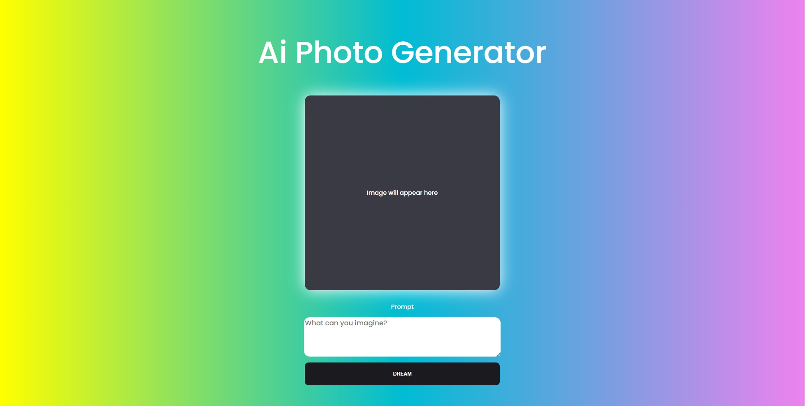
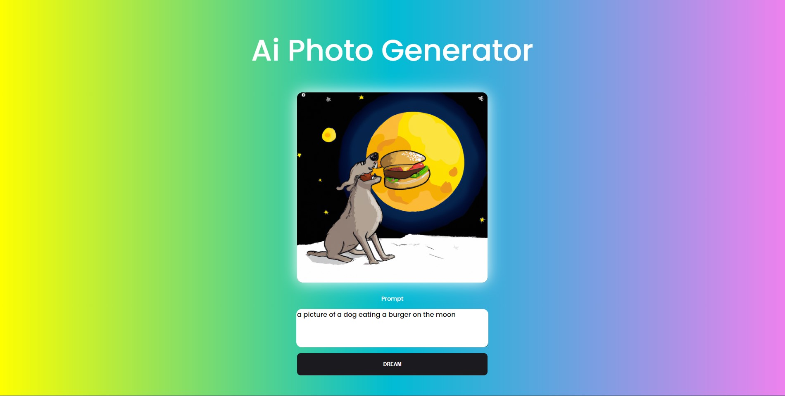

This project utilises the OpenAi API to send a prompt and return an image based on the prompt used.

This app was a great learning experince for successfull executing a PUT request and also fetching information back.

Tech used;

- HTML
- CSS
- NodeJS
- Express
- RapidAPI for testing

Home

Result

